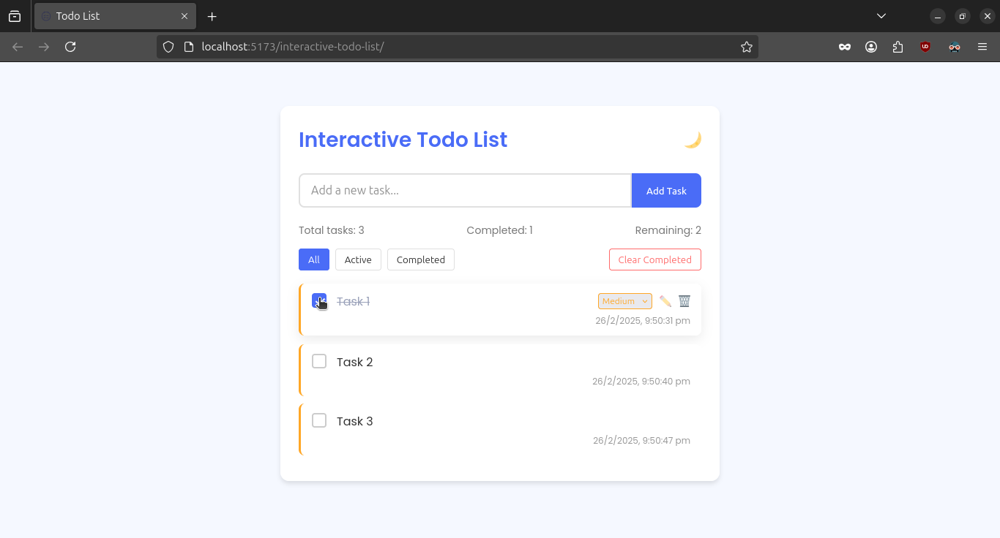
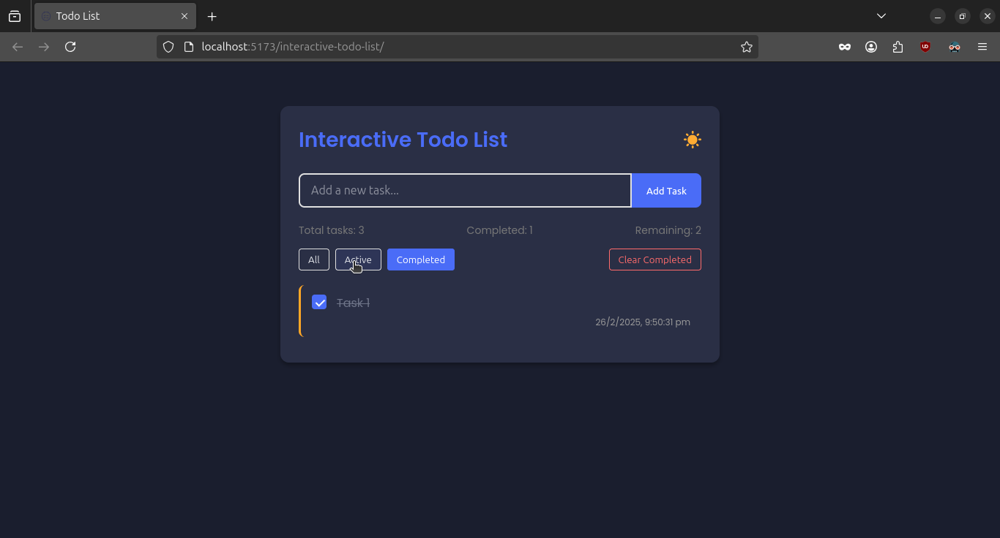

# Interactive Todo List

A beautifully designed Todo List application built with React that helps you manage your tasks efficiently.

## Features

- ✅ Add, edit, complete, and delete tasks
- 🌈 Priority levels (low, medium, high) with color coding
- 🔍 Filter tasks by All, Active, or Completed
- 💾 Local storage persistence
- 🌓 Dark/Light theme toggle
- 📊 Task statistics
- ⏱️ Timestamps for task creation
- 📱 Fully responsive design
- ✨ Smooth animations and transitions

## Demo

View the live demo: [Todo List](https://kokane-vishal.github.io/interactive-todo-list/)

## Technologies Used

- React
- Vite

### Screenshots


---



### Prerequisites
- Node.js and npm installed

### Installation
1. Clone or Download the repository
   ```bash
   git clone https://github.com/kokane-vishal/interactive-todo-list.git
   ``` 
2. Navigate to the project directory
   ```bash
   cd todo-list
   ```
3. Install dependencies
   ```bash
   npm install
   ```
4. Start the development server
   ```bash
   npm run dev
   ```
